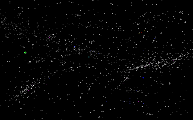
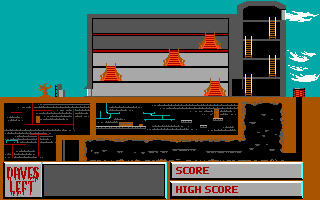
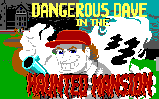
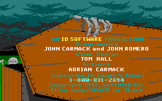
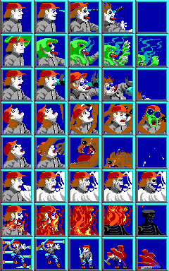

## Part 1: Introduction

Programmed by the two Johns at id software, Dangerous Dave in The Haunted Mansion was released for IBM PC in 1991. If you have never played dave2, you may think that this is yet another platformer in the favor of Command Keen; well, if you have played it, you know it’s closer to the Doom frenchise. Master Tom Hall designed this game for Softdisk’s Gamer’s Edge disk right after leaving Softdisk and founding id. With Adrian Carmack on the graphics, the game featured so much gore (for pixelated graphics, of course) that some of it had to be removed.

It’s true that the year 1991 has seen games with better graphics than dave2. Heck, it’s the year that Another World and Monkey Island 2 were released. Nevertheless, id had to cramp their game to fit in a 360k floppy, and run on 286/386 computers with EGA displays. The platform game engine that runs dd2 was used to make Shadow Knights just before that, so I figure that whatever is said here also applies there.

I strongly recommend the Planet Romero’s [https://web.archive.org/web/20080404232301/http://rome.ro/article_saga_dave.htm](The Saga of Dangerous Dave) article, and the awesome book Masters of Doom.

On with my story:

Dave has always been one of my most favorite characters. I started the project when I woke up one day with a vision for a new episode of Dangerous Dave. With that idea in mind, I thought that it would be nice to start with the sprites of the original dave2, since I can’t do any pixelart (can anybody here do pixelart?). Before long, I was sucked into it, and ended up reverse-engineering the entire game. I have split the article into several subpages and I wish you a pleasant reading.


## Part 2: Files and compression

Your 360KB floppy has the following files on it:

```
dave2.exe
level01.dd2
level02.dd2
level03.dd2
level04.dd2
level05.dd2
level06.dd2
level07.dd2
level08.dd2
intro.dd2
egatiles.dd2
s_chunk1.dd2
s_chunk2.dd2
s_dave.dd2
s_frank.dd2 <—–
s_master.dd2
title1.dd2
title2.dd2
progpic.dd2
```

I don’t know about you, but I was immediately curious, who the hell is Frank?

The game executable is dave2.exe, game logic is not spanned over other files (neither code nor script.) Hexediting the files, I noticed that most files start with a nice HUFF signature. The level%02d, egatiles.dd2 and intro.dd2 are the only files that seem uncompressed. Furthermore, they are the smallest files on disk.

So, the first step was figuring out what is this HUFF mambo jambo. Firing up my favorite disassembler, I got down to work. Locating the code that checks for that magic signature was quite simple. I copy-pasted the assembly code onto a clean .c file, and started working out some sense in those nasty loops. Soon enough, I had this neat 90 lines Huffman decompressor and it unpacked all HUFF .dd2 files flawlessly. I was amazed to find out such a simple compression saved ~50%, which is the difference between a game on two floppies and on one. Sweet.

But let’s take this one step at a time…


## Part 3: Title screens

Here are the background bitmaps (or title screens,) taken from dave2 floppy. All of these images were compressed using some flavor of Huffman. Decompression code starts at seg000:7936h, and was quite clean to follow. Figuring that this is the actually unhuff code was quite easy: each compressed file has a nice “HUFF” signature, I looked up the string and from there I just checked cross-reference. There was only one location that had anything to do with the signature string, and that very same function also prints out “Tried to expand a file that isn’t HUFF!” when it fails. So, as they say, X marks the spot.

Rewriting deflate algorithms is always tricky. Even if you know how it is supposed to work, you can never be sure the original coders haven’t tweaked it for one reason or another. When I get to a decompression code, I just copy-paste the assembly code into a clean C file. `Hello, my name is Gil, and I’m a goto user`. The initial code that was written and actually ran, looked completely horrible. The variable names were named after the registers; arrays were just prefixed ‘dummy’. I consider rewriting obscure code a game on its own. You start with something that works okay, but looks bad, and your goal is to make it look good and readable, without breaking what already works.

Within less than an hour I have rewritten the deflation code, got rid of all the assembly leftovers, and as a Good Samaritan, I even commented my code. After unpacking these full screen bitmaps, I noticed a new file format. It begins with “PIC\0“, followed by a short valued 320, and another that is 200. The other 32000 bytes are 320×200 pixels layered as 4 bitplanes (gotta love EGA!)

Coders who have done some EGA work know exactly what pain it is to work with these bit planes. Looking back at this, it is very good I started with the full screen bitmaps; it is much easier to try and figure out what’s going on a big bitmap, rather on a 16×16 sprite. With my swiss-knife uber-library PIL (Python Imaging Library), I hacked up a small script that converts these 32008 files into PNGs.

The decompression code is available for download, and is called decompress.c (well, d’uh).



starpic.dd2 - displayed as a background for Gamers Edge logo



progpic.dd2 - displays player status during load



title1.dd2



title2.dd2

## Part 4: Sprites
Now, the sprites were a real bitch to extract. After unpacking these .dd2 files, I wrote a simple script that converts these outputs into something visible. I couldn’t make much out of what was appearing on my monitor. Thought, I did notice something interesting: other than the garbage that was now occupying most of my screen, the upper-left 24×32 pixels were actually making sense!

They were somewhat making a distorted image of Dave. The colors were wrong also, but that means that my initial assumption of EGA bit plane offsets were wrong. I dug through the disassembled code again, and noticed that the first 2 bytes of the deflated sprite files were used in the function that I previously named ‘put_ega_tile‘. Went back to my script, and tried using that magic number as the distance between bit planes.

Voila! It worked! Now I manage to see a clear image of Dave, spanning over 16 sprites. It is truly a great feeling, having nothing for a while and all of a sudden seeing something being properly displayed. The next sprites were garbled; I could see that they were of the right colors, and the pixels made some sense in small blocks, but the overall view was complete crap. Then it hit me — These sprites are not of the same dimensions; I multiplied the bytes-per-bitplane by 4 (2^4 = 16 colors,) and it was exactly the same as the deflated file. This could only mean one thing: the sprite dimensions are not stored in the sprite files; they are in the executable.

I recalled seeing some funny strings in the executable, like “DAVESTANDE“, I looked it up again and found that Seg005 was full of these; 10 bytes strings, followed by several 16 bit shorts. Since I knew the first sprite was of Dave in a standing (idle) position, I figured that the next shorts were width (divided by 8px), and height (in pixels.) A few more shorts followed, but they were of no interest to me. My guess is that they stand for hotspot position, file offset or stuff like that. So, I decided that it would just be simpler to find the sprite dimensions by simple trial and error. I just guessed the dimensions: if I were correct, I saw the right sprite; if not, I just saw garbled pile of tiles. I know it might seem strange and stupid, but really, it took 5 minutes to get the rest of the sprites out :)

view-sprites.py creates a png for each sprite descriptor file; it blits all sprites horizontally next to each other. You can click on the thumbnails below and get a full 1:1 dump.


s_dave.dd2


s_chunk1.dd2


s_chunk2.dd2


s_frank.dd2 (<– this is Frank!)


s_master.dd2

## Part 5: Levels

Like most platform games, Dangerous Dave uses tiles to save memory and keep footprint small. All levels share the same tile map, which is stored uncompressed in a file called egatiles.dd2. Tiles are stored sequentially, but independent from each other. 16 x 16 pixels, tiles are 4bit and written down in interleaved EGA representation. There is no header in this file, and tiles are not tagged or indexed in any way. In the dump below, you can see that there are 13 tiles across, yielding a width of 208 pixels; it’s a magic number I just guessed, as it brings out something nicely viewable. Grab a quick look at the tiles, and you will see that several tiles are marked with the text ‘free’, others are just empty boxes, and some are even unused in the game.

egatiles.dd2
Levels descriptors are these small files named level%02d.dd2, there are 8 such files, hence only 8 levels. Each file is compressed using RLEW, which is an rle compression that works on 16 bits words.

```
0000000030: 4A 00 FE FE 27 00 33 00 ? 4A 00 FE FE 04 00 33 00
```

Quite simple, when hitting a 0xfefe magic, the next word is the count, followed by the value. Replace these 3 words with value x count and you’re done.
Here are the first 0×50 uncompressed bytes from the first level:

```
0000000000: 20 39 00 00 40 00 39 00 ? 02 00 00 00 00 00 50 00
0000000010: 2a 00 80 1c 80 03 80 36 ? 80 60 81 40 83 80 86 0c
0000000020: 80 04 84 60 33 00 33 00 ? 33 00 33 00 33 00 33 00
0000000030: 33 00 33 00 33 00 33 00 ? 33 00 33 00 33 00 33 00
0000000040: 33 00 33 00 33 00 33 00 ? 33 00 33 00 33 00 33 00
```

Bytes 0×00 - 0×03: Size of unpacked file (must not be 0xfefe:))

Bytes 0×04 - 0×05: Level width in tiles (16 pixels)

Bytes 0×06 - 0×7: Level height in tiles (16 pixels)

The rest of the level is split into two parts, the visual (rasterable) section, and magic locations (for monsters, start and exit, power-ups and doors.) The two sections are exactly width*height*16bit each. In the visual section, each such 16 bit word represents an index into the linear tile map. Here are some magic numbers from the second section, these values were retrieved via trial and error. I can’t say I spent a lot of time on this, but the idea should be clear:

```
Tag 0×0001: Zombie
Tag 0×0002: Old lady with a knife
Tag 0×00ff: Player initial location (entry point)
Tag 0×0010: 400 points
Tag 0×0013: 1UP
Tag 0×0633: Teleport 1
Tag 0×0a06: Teleport 2
Tag 0×8001: 100 points inside a closet
```

The level-to-png.py script rasterizes a level previously unpacked with unpack-level.py. Here is the first level; you may notice that some of tiles are never seen on screen. There’s also a modified copy, which was made using my level editor.

level01.dd2
!(Dangerous Dave level 1)[images/level01.png]

## Part 6: Wait, something is missing
Something was clearly missing! I have been digging the files again, how could I have missed it?? It just wasn’t there!

Whenever Dave died, he did it in style: at the center of the screen appeared a very small animation, showing Dave slashed, slimed, beat, chopped or killed in some form or another. Each such animation sequence is 5 frames long, with a delay of ~500ms between them. The reason why I couldn’t find these graphics easily, was because they have no data file of their own. Data has been embedded inside the executable, for an obvious reason: the .exe file is actually compressed with PKLITE (LZ91 signature). This compression is much stronger than the Huffman compression used for backgrounds, and since these graphics are required for each and every level, I guess it makes sense that they were placed inside the executable.

I call this one “the-death-of-dave”:




## Part 7: What’s next for Dave?
As I mentioned earlier, I am passionate about making a new Dave episode. There are actually 7 other Dangerous Dave games, but nobody speaks of them.

I am talking about a game that is featuring Dave’s cold personality, with Metal Slug-like levels and Castlevania-like bosses, and of course Paul Robertson’s mighty Pirate Baby’s Cabana Battle Street Fighter 2006-like body count and blood-sprinklers.

I have some ideas brewing up for some time now. I am looking for people with strong passion for making games. If you are a graphics artist, either backgrounds or pixelart, make sure you contact me :)

This is it. I hope you enjoyed reading this article. Writing the first of a series is always the most difficult, so please make sure you point out what you liked and what you didn’t like in these pages; that way I can learn from mistakes and make better articles.

These are the programs used and mentioned throughout the article:

decompress.c - deflates “HUFF” files
unpack-level.py - unpacks RLEW used in level%02d
level-to-png.py - renders a level (depends on unpack-level.py)
show-tiles.py - converts EGATILES.DD2 file to png
pic2png.py - converts a “PIC“ file to a png (depends on decompress.c)
view-death-sequences.py - converts embedded animations to png
view-sprites.py - converts sprites in seperate pngs (depends on decompress.c)
ega_palette.py - EGA palette, required by most scripts

I even did some code for a level editor. I have no idea why, but I worked on it. As I said before, this game has put a magic spell on me. Anyway, click on the screen shot for a full size view.


Cheers!
– gawd, 2006


